# 🔐 Infraestructura 2 — VPN Site-to-Site entre un FortiGate y un Router Cisco

**Matrícula 20252241**


> Un firewall FortiGate (configurado por GUI) y un router Cisco (configurado por CLI) conectados a través de un ISP y unidos mediante una VPN IPsec site-to-site entre peers de distinto fabricante. Un usuario (VLAN 10, DHCP) accede a un servidor web detrás del router Cisco, y la comunicación solo fluye mientras el túnel VPN está activo.

---

## 📺 Video de Demostración

> **[Ver demostración en YouTube →](https://www.youtube.com/watch?v=EGvrQycYJrE)**

---

## 📑 Tabla de Contenido

1. [Objetivo de la Red](#-objetivo-de-la-red)
2. [Cumplimiento de Requisitos](#-cumplimiento-de-requisitos)
3. [Direccionamiento IP basado en la matrícula (VLSM)](#-direccionamiento-ip-basado-en-la-matrícula-vlsm)
4. [Parámetros Usados](#-parámetros-usados)
5. [Documentación de la Red](#️-documentación-de-la-red)
6. [Funcionamiento de la Configuración](#-funcionamiento-de-la-configuración)
7. [Configuración de la VPN](#-configuración-de-la-vpn)
8. [Validación de la Implementación](#-validación-de-la-implementación)
9. [Estructura del Repositorio](#-estructura-del-repositorio)

---

## 🎯 Objetivo de la Red

Comunicar a un **Usuario** con un **Servidor Web** ubicados en sitios distintos, a través de una **VPN IPsec site-to-site** entre un FortiGate y un router Cisco, y comprobar que **la comunicación solo fluye si el enlace VPN está activo**.

Los dos sitios están separados por un ISP que solo conoce las redes públicas de los enlaces. Como el ISP no tiene rutas hacia las redes internas (Usuarios y Servidor), sin el túnel no existe camino entre ambos sitios. Al levantar el túnel, el tráfico viaja cifrado entre el FortiGate y el router Cisco, y el usuario puede consultar el servidor.

---

## ✅ Cumplimiento de Requisitos

| Requisito | Implementado con |
| --- | --- |
| FortiGate configurado por GUI | Interfaces, DHCP, políticas, NAT y VPN configurados desde la interfaz web de FortiOS |
| Configuraciones de red (FortiGate) | Interfaz WAN, subinterfaz VLAN 10 y rutas estáticas |
| NAT (FortiGate) | Política `user-a-internet` con NAT habilitado hacia el ISP; en las políticas de la VPN el NAT está deshabilitado |
| Configuraciones de red (Cisco) | Interfaz WAN hacia el ISP e interfaz LAN hacia el servidor |
| NAT (Cisco) | PAT (`ip nat inside source list 101 interface FastEthernet1/0 overload`) |
| VPN Site-to-Site entre peers | Túnel IPsec IKEv1 entre el FortiGate (`vpn-forti-cisco`) y el router Cisco (`crypto map VPN-MAP`) |
| ISP con IPs públicas | Router `isp-2241` con un enlace público hacia cada extremo (`22.41.3.1` y `22.41.4.1`) |
| Servidor Web (/28) con HTTPS | Servidor web Ubuntu con HTTPS en `10.22.41.128/28` |
| Usuarios (/25) en VLAN 10 con DHCP | Subinterfaz VLAN 10 (`10.22.41.1/25`) en el FortiGate con servidor DHCP |
| Traceroute hacia el servidor | Captura del traceroute desde el usuario con el túnel activo |
| Comunicación solo con VPN activa | Pruebas con el túnel arriba, abajo y restablecido |
| Direccionamiento basado en la matrícula | Redes derivadas de los dígitos `22` y `41` de la matrícula y subdivididas con VLSM |

---

## 🧮 Direccionamiento IP basado en la matrícula (VLSM)

### 1. Origen de las direcciones

Mi matrícula es **2025-2241** (`20252241`). Tomé sus **últimos cuatro dígitos, `2241`**, y los separé en dos pares, **`22`** y **`41`**, que son los que aparecen en todas las redes del laboratorio:

| Dígitos de la matrícula | Dónde se usan | Ejemplo |
| --- | --- | --- |
| `22` → segundo octeto | Redes LAN privadas (Usuarios y Servidor) | 10.**22**.41.0 |
| `41` → tercer octeto | Redes LAN privadas (Usuarios y Servidor) | 10.22.**41**.0 |
| `22.41` → dos primeros octetos | Enlaces "públicos" entre el ISP y los extremos de la VPN | **22.41**.3.0/30 y **22.41**.4.0/30 |

En los enlaces públicos el tercer octeto numera cada enlace: `3` y `4` en esta infraestructura.

### 2. Bloque base y requisitos

El bloque base de las redes internas es **`10.22.41.0/24`** (254 hosts). La tarea exige:

- Una red de **Usuarios de tipo /25**.
- Una red de **Servidor de tipo /28**.
- Enlaces con IPs públicas entre el ISP y cada extremo de la VPN (punto a punto).

### 3. Subdivisión con VLSM

Se aplicó **VLSM (Variable Length Subnet Mask)**: se asigna primero la subred más grande y después las más pequeñas, usando un prefijo distinto para cada segmento según los hosts que necesita. Así no se desperdician direcciones y las subredes no se solapan, condición necesaria para que la VPN enrute correctamente cada red.

| # | Segmento | Prefijo | Máscara | Hosts útiles | Red | Rango utilizable | Broadcast |
| --- | --- | --- | --- | --- | --- | --- | --- |
| 1 | Usuarios (VLAN 10) | /25 | 255.255.255.128 | 126 | 10.22.41.0 | 10.22.41.1 – 10.22.41.126 | 10.22.41.127 |
| 2 | Servidor Web | /28 | 255.255.255.240 | 14 | 10.22.41.128 | 10.22.41.129 – 10.22.41.142 | 10.22.41.143 |
| 3 | Enlace ISP ↔ FortiGate | /30 | 255.255.255.252 | 2 | 22.41.3.0 | 22.41.3.1 – 22.41.3.2 | 22.41.3.3 |
| 4 | Enlace ISP ↔ Router Cisco | /30 | 255.255.255.252 | 2 | 22.41.4.0 | 22.41.4.1 – 22.41.4.2 | 22.41.4.3 |

**Cálculo de cada prefijo:**

- **/25:** 32 − 25 = 7 bits de host → 2⁷ = 128 direcciones → 126 hosts útiles. Bloque `10.22.41.0 – 10.22.41.127`.
- **/28:** 32 − 28 = 4 bits de host → 2⁴ = 16 direcciones → 14 hosts útiles. Empieza justo donde termina la red de Usuarios: `10.22.41.128 – 10.22.41.143`.
- **/30:** 32 − 30 = 2 bits de host → 2² = 4 direcciones → 2 hosts útiles, los justos para un enlace punto a punto.

El resto del bloque (`10.22.41.144 – 10.22.41.255`) queda libre para crecimiento futuro.

### 4. Asignación de direcciones

| Dispositivo | Interfaz | IP | Subred |
| --- | --- | --- | --- |
| FortiGate | VLAN 10 (sobre port2) | 10.22.41.1 | 10.22.41.0/25 |
| Usuario | ens3 (DHCP, rango .10 – .100) | 10.22.41.x | 10.22.41.0/25 |
| Router Cisco | FastEthernet1/1 (LAN) | 10.22.41.129 | 10.22.41.128/28 |
| Servidor Web | ens3 | 10.22.41.130 | 10.22.41.128/28 |
| isp-2241 | FastEthernet1/0 | 22.41.3.1 | 22.41.3.0/30 |
| FortiGate | `WAN-ISP` (port1) | 22.41.3.2 | 22.41.3.0/30 |
| isp-2241 | FastEthernet1/1 | 22.41.4.1 | 22.41.4.0/30 |
| Router Cisco | FastEthernet1/0 (WAN) | 22.41.4.2 | 22.41.4.0/30 |

**Evidencia en los equipos:**

Interfaces del router ISP con las IPs de los enlaces públicos:

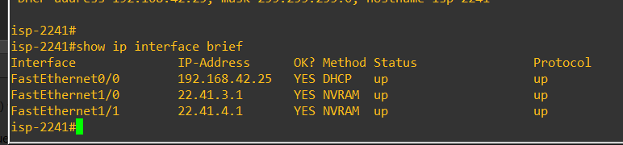

Subinterfaz VLAN 10 del FortiGate (`10.22.41.1/25`) y su servidor DHCP (`10.22.41.10 – 10.22.41.100`):

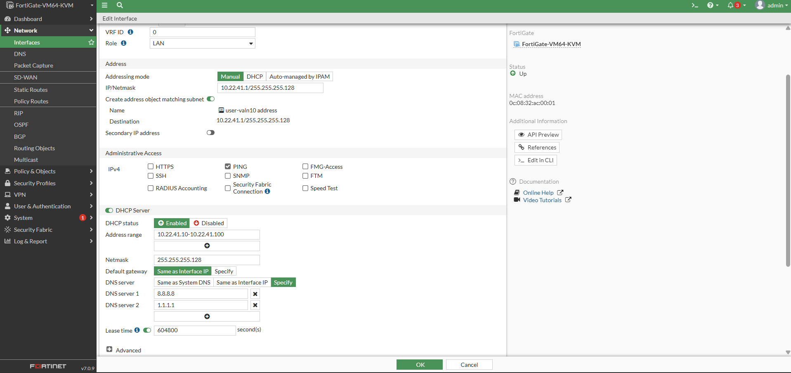

---

## 🧩 Parámetros Usados

| Parámetro | Valor |
| --- | --- |
| Plataforma FortiGate | FortiGate-VM64-KVM, FortiOS 7.0.9 |
| Equipo de red | Router Cisco (`router-2241`) |
| ISP | Router Cisco (`isp-2241`) |
| Switch | Cisco IOSvL2 (`switch-2241-1`) |
| Emulador | GNS3 |
| Red de Usuarios (VLAN 10) | `10.22.41.0/25` — gateway `10.22.41.1`, DHCP `10.22.41.10 – 10.22.41.100` |
| Red del Servidor | `10.22.41.128/28` — gateway `10.22.41.129`, servidor `10.22.41.130` |
| Enlace ISP ↔ FortiGate | `22.41.3.0/30` |
| Enlace ISP ↔ Router Cisco | `22.41.4.0/30` |
| Túnel en el FortiGate | `vpn-forti-cisco` (interfaz `WAN-ISP`, port1), peer `22.41.4.2` |
| Túnel en el Cisco | `crypto map VPN-MAP` (interfaz FastEthernet1/0), peer `22.41.3.2` |
| Autenticación | Clave precompartida (Pre-shared Key) |

---

## 🗺️ Documentación de la Red

### Topología

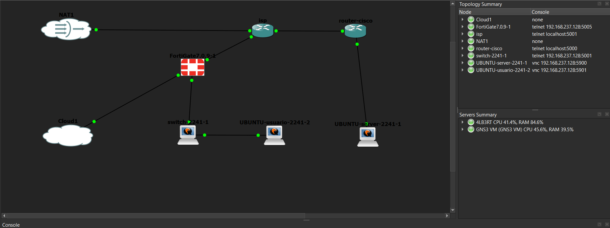

### Diagrama de la VPN

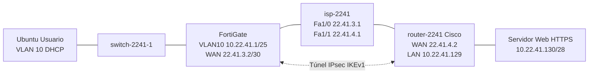

### Switch y VLAN 10

VLAN 10 creada en el switch:

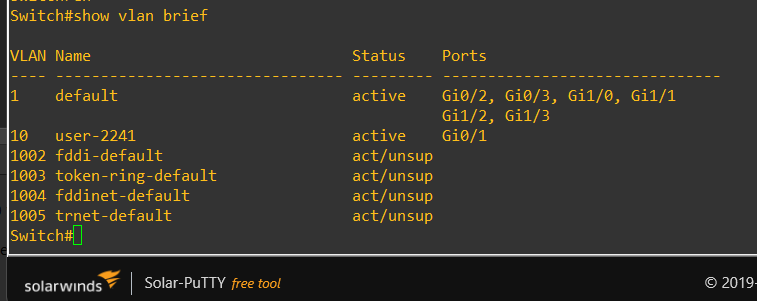

Enlace trunk hacia el FortiGate:

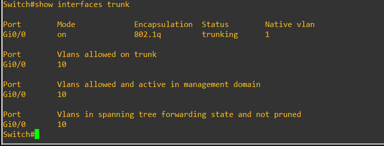

### Usuario (VLAN 10, DHCP y traceroute)

IP recibida por DHCP y traceroute hacia el servidor:

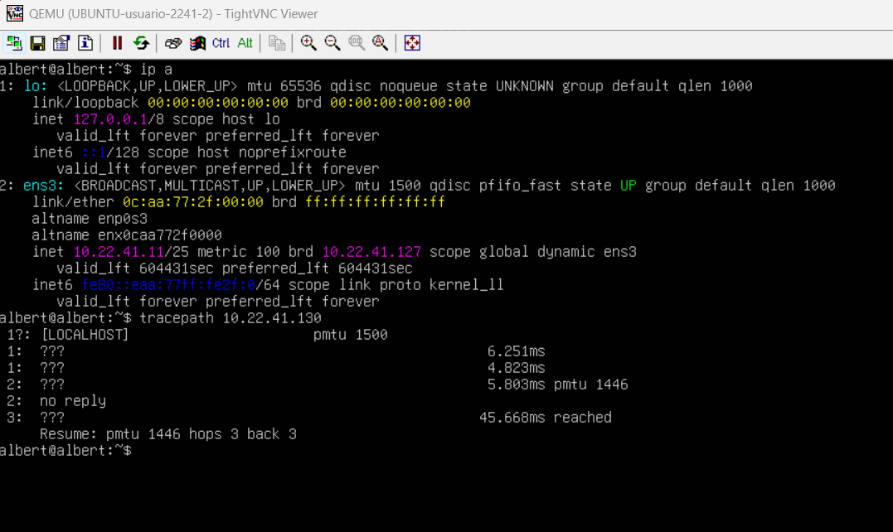

### FortiGate

Interfaces (WAN, VLAN 10 con DHCP e interfaz del túnel):

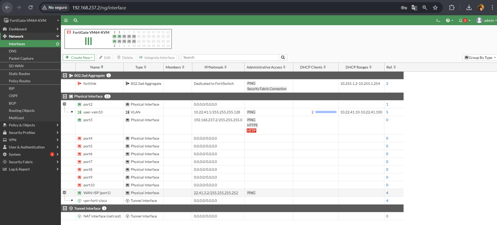

Rutas estáticas:

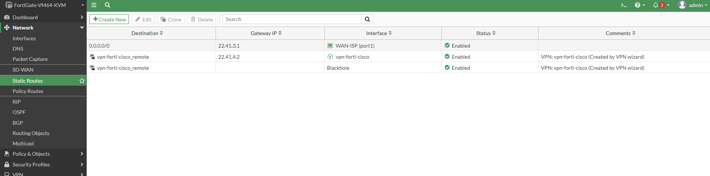

Políticas de firewall (NAT habilitado hacia el ISP y deshabilitado en las políticas de la VPN):

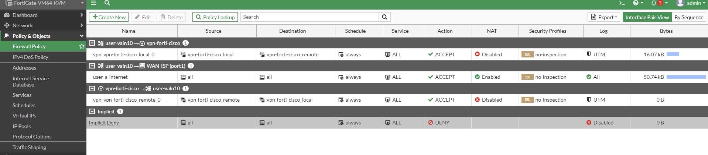

### Router Cisco

Interfaces:

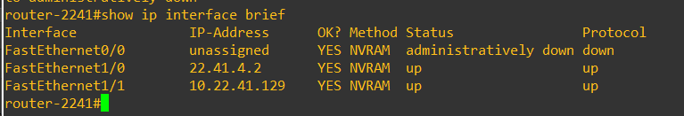

NAT (PAT) en funcionamiento, con el servidor traducido a la IP pública `22.41.4.2`:

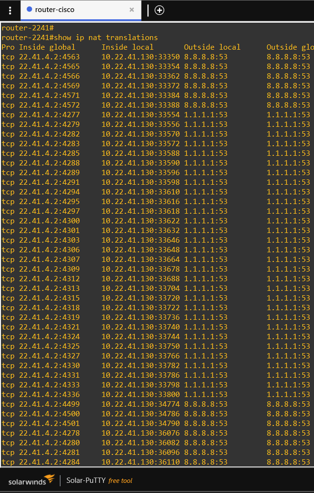

### Servidor Web

Dirección IP del servidor (`10.22.41.130/28`):


> Los nodos NAT1 y Cloud1 de la topología solo se usaron para dar acceso a internet durante la instalación y para entrar a la GUI del FortiGate; no forman parte del escenario evaluado.

---

## 🔬 Funcionamiento de la Configuración

**Segmentación:** el switch entrega la VLAN 10 al usuario y la une por trunk al FortiGate, que termina la VLAN como subinterfaz 802.1Q sobre `port2` y le entrega direcciones por DHCP. El servidor está directamente detrás del router Cisco.

**ISP:** el router `isp-2241` solo tiene direccionamiento público en sus dos enlaces (`22.41.3.1` y `22.41.4.1`). No posee rutas hacia las redes internas, por lo que sin VPN ambos sitios son inalcanzables entre sí.

**VPN IPsec site-to-site entre peers de distinto fabricante:** el FortiGate y el router Cisco se definen mutuamente como peer usando sus IPs públicas. Los parámetros de la Fase 1 y la Fase 2 deben coincidir en ambos lados para que el túnel levante (ver la sección siguiente). El tráfico interesante es el que va entre la red de Usuarios (`10.22.41.0/25`) y la red del Servidor (`10.22.41.128/28`).

**NAT:** el tráfico hacia internet sale traducido en ambos extremos: PAT en el router Cisco y NAT en la política de salida del FortiGate. El tráfico de la VPN no se traduce (NAT deshabilitado en las políticas de la VPN del FortiGate).

**Dependencia del túnel:** al desactivar el túnel, el tráfico entre Usuarios y Servidor deja de tener camino. Al restablecerlo, la comunicación se recupera.

---

## 🔧 Configuración de la VPN

> El FortiGate se configuró desde la GUI (**VPN → IPsec Wizard**). El router Cisco se configuró por CLI. Las configuraciones completas están en la carpeta `running-configs/`.

### Parámetros que coinciden en ambos extremos

| Parámetro | FortiGate (GUI) | Router Cisco (CLI) |
| --- | --- | --- |
| Peer remoto | `22.41.4.2` | `22.41.3.2` |
| Versión IKE | IKEv1, modo Main | IKEv1 (ISAKMP) |
| Autenticación | Pre-shared Key | `authentication pre-share` |
| Fase 1 — cifrado y hash | DES con MD5 / SHA1 | DES con SHA (valores por defecto de la política) |
| Fase 1 — grupo Diffie-Hellman | 5 (y 14) | `group 5` |
| Fase 1 — tiempo de vida | 86400 s | 86400 s (valor por defecto) |
| Fase 2 — cifrado y autenticación | DES con MD5 / SHA1 | `esp-des esp-sha-hmac`, modo `tunnel` |
| Fase 2 — PFS | Habilitado, grupo 5 (y 14) | `set pfs group5` |
| Fase 2 — tiempo de vida | 43200 s | `set security-association lifetime seconds 43200` |
| Tráfico protegido | `vpn-forti-cisco_local` ↔ `vpn-forti-cisco_remote` | ACL `VPN-TRAFFIC` (`10.22.41.128/28` ↔ `10.22.41.0/25`) |

### FortiGate

Fase 1:

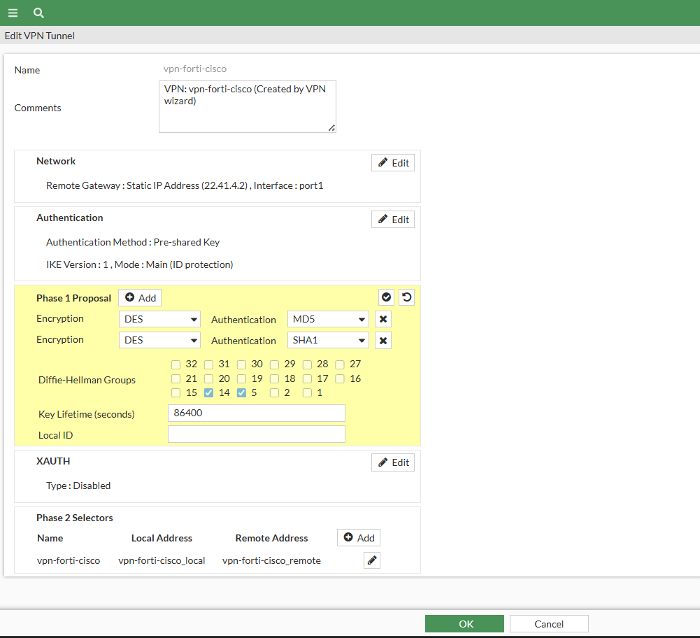

Fase 2:

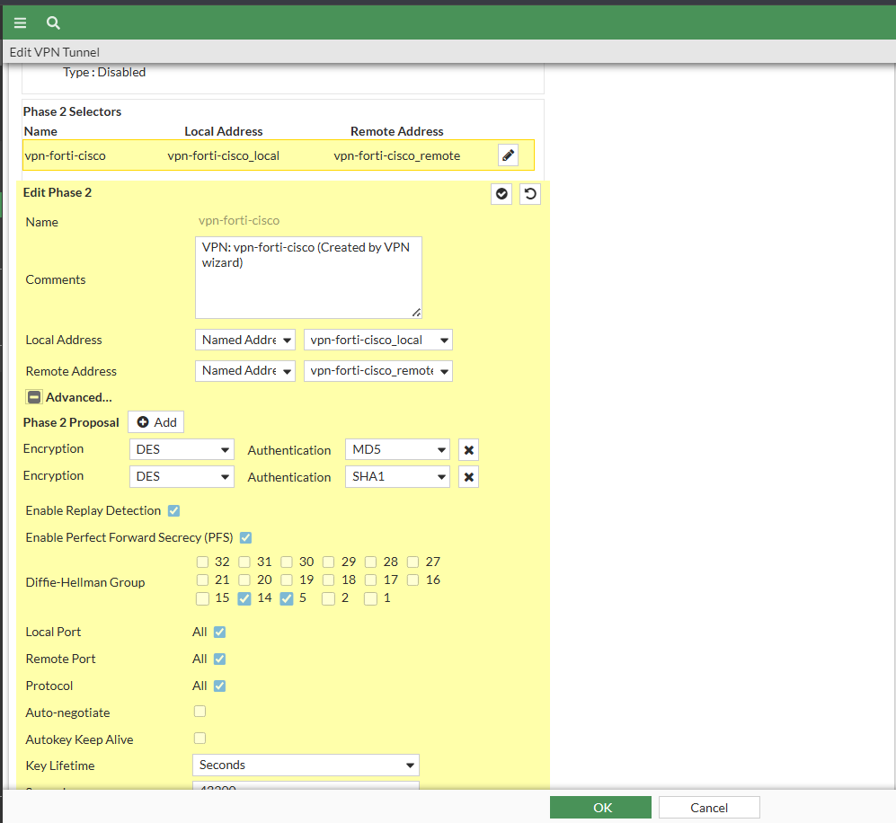

Estado del túnel:

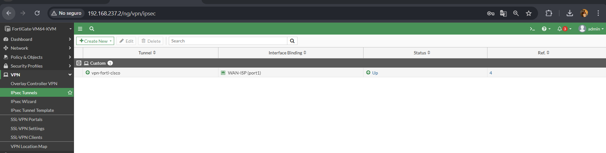

### Router Cisco

Configuración de la VPN (`show running-config | section crypto`) y del NAT:

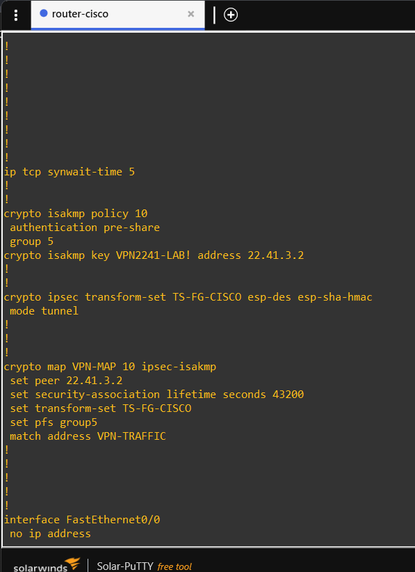

> La clave precompartida está ocultada en las capturas y en los archivos de `running-configs/`.

Fase 1 activa (`QM_IDLE`, `ACTIVE`):

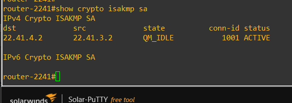

Tráfico cifrado por el túnel (Fase 2):

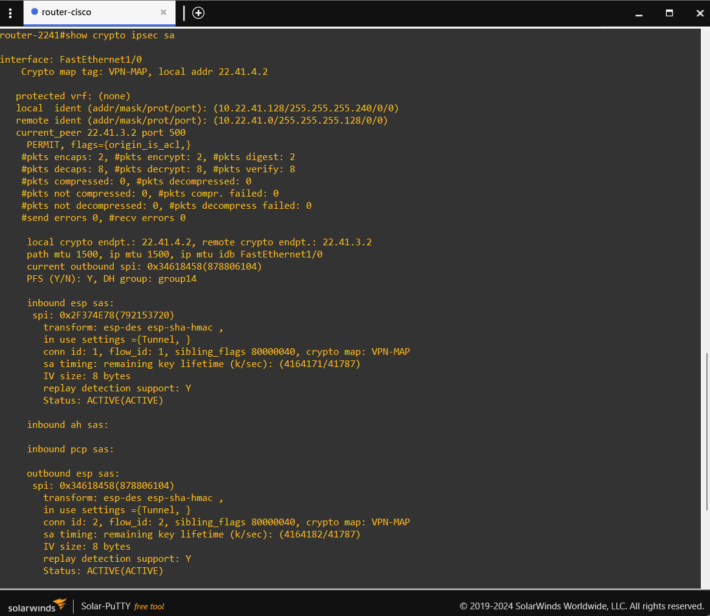

---

## ✅ Validación de la Implementación

**Prueba 1 — Usuario obtiene IP por DHCP:** `ip a` en el usuario muestra una dirección de la red `10.22.41.0/25` asignada por el FortiGate.

**Prueba 2 — Túnel activo:** en el FortiGate el túnel `vpn-forti-cisco` aparece en estado *Up*, y en el Cisco `show crypto isakmp sa` muestra la Fase 1 en `QM_IDLE` y `ACTIVE`.

**Prueba 3 — Servidor con HTTPS:** el servidor responde por HTTPS desde el usuario con el túnel activo:

```
ping -c 3 10.22.41.130
traceroute 10.22.41.130
curl -k https://10.22.41.130
```

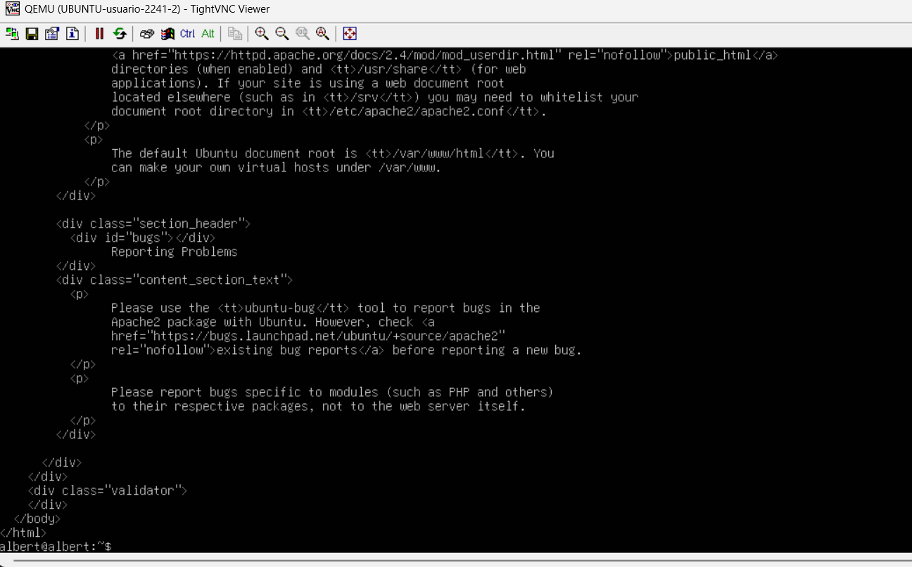

**Prueba 4 — Túnel caído:** se desactiva el túnel y el ping al servidor no responde (100 % de pérdida):

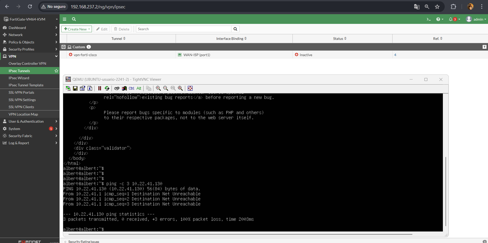

**Prueba 5 — Túnel restablecido:** se vuelve a activar el túnel y la comunicación se recupera (ping y HTTPS):

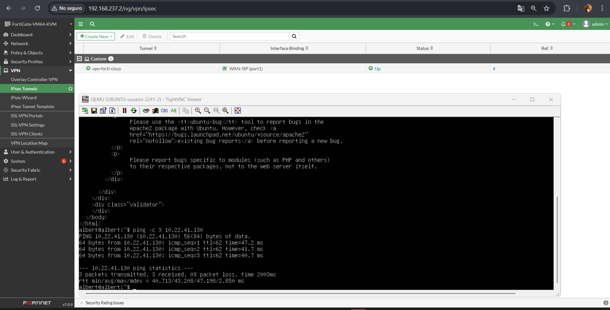

---

## 📁 Estructura del Repositorio

```
README.md
image/
├── 01-topologia.png
├── 02-isp-show-ip-interface-brief.png
├── 03-show-vlan-brief.png
├── 04-show-interfaces-trunk.png
├── 05-usuario-dhcp-traceroute.png
├── 06-fortigate-interfaces.png
├── 07-fortigate-vlan10-dhcp.png
├── 08-fortigate-static-routes.png
├── 09-fortigate-firewall-policy.png
├── 10-fortigate-tunel-up.png
├── 11-configuracion-tunel-fase1.png
├── 11-configuracion-tunel-fase2.png
├── 12-cisco-show-ip-interface-brief.png
├── 13-cisco-config-crypto-nat.png
├── 14-cisco-isakmp-sa.png
├── 15-cisco-ipsec-sa.png
├── 16-cisco-nat-translations.png
├── 17-ip-a-servidor.png
├── 18-curl-https.png
├── 19-tunel-caido-ping.png
└── 20-tunel-restablecido.png

running-configs/
├── isp-2241.txt
├── router-2241.txt
├── switch-2241-1.txt
└── FortiGate.conf
```
